<!-- ============ FULL-BLEED ANIMATED PROFILE ============ -->

  

<!-- ============ LINKS ============ -->

&nbsp;

&nbsp;

  

<!-- ============ PROFILE STATS ============ -->

&nbsp;

  

<!-- ============ GITHUB STATS ============ -->

  

<!-- ============ GITHUB STREAK ============ -->

  

<!-- ============ ACTIVITY GRAPH ============ -->

  

<!-- ============ FOOTER ============ -->

